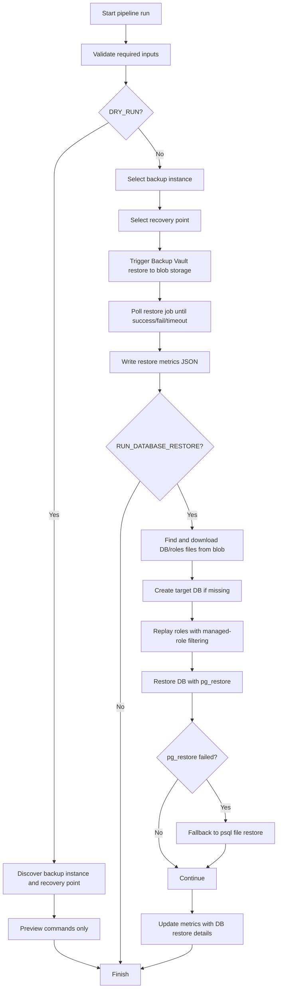

# PostgreSQL Restore Workflow Diagram

```mermaid
flowchart TD
    A[Start pipeline run] --> B[Validate required inputs]
    B --> C{DRY_RUN?}

    C -->|Yes| D[Discover backup instance and recovery point]
    D --> E[Preview commands only]
    E --> Z[Finish]

    C -->|No| F[Select backup instance]
    F --> G[Select recovery point]
    G --> H[Trigger Backup Vault restore to blob storage]
    H --> I[Poll restore job until success/fail/timeout]
    I --> J[Write restore metrics JSON]

    J --> K{RUN_DATABASE_RESTORE?}
    K -->|No| Z

    K -->|Yes| L[Find and download DB/roles files from blob]
    L --> M[Create target DB if missing]
    M --> N[Replay roles with managed-role filtering]
    N --> O[Restore DB with pg_restore]
    O --> P{pg_restore failed?}
    P -->|Yes| Q[Fallback to psql file restore]
    P -->|No| R[Continue]
    Q --> R
    R --> S[Update metrics with DB restore details]
    S --> Z[Finish]
```
