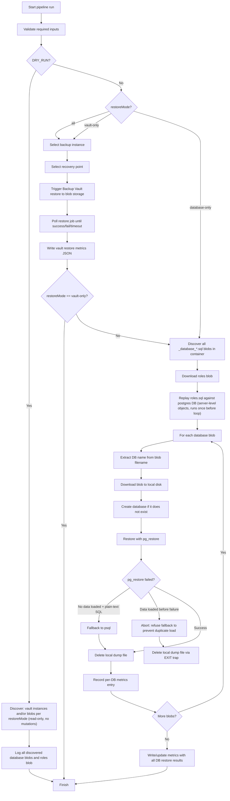

# PostgreSQL Restore Workflow Diagram

```mermaid
flowchart TD
    A[Start pipeline run] --> B[Validate required inputs]
    B --> C{DRY_RUN?}

    C -->|Yes| D["Discover: vault instances and/or blobs per restoreMode (read-only, no mutations)"]
    D --> E[Log all discovered database blobs and roles blob]
    E --> Z[Finish]

    C -->|No| SC{restoreMode?}

    SC -->|all| F[Select backup instance]
    SC -->|vault-only| F
    SC -->|database-only| L

    F --> G[Select recovery point]
    G --> H[Trigger Backup Vault restore to blob storage]
    H --> I[Poll restore job until success/fail/timeout]
    I --> J[Write vault restore metrics JSON]

    J --> K{restoreMode == vault-only?}
    K -->|Yes| Z

    K -->|No| L[Discover all _database_*.sql blobs in container]
    L --> L2[Download roles blob]
    L2 --> N["Replay roles.sql against postgres DB (server-level objects, runs once before loop)"]
    N --> LOOP_START["For each database blob"]

    LOOP_START --> O[Extract DB name from blob filename]
    O --> O2[Download blob to local disk]
    O2 --> M[Create database if it does not exist]
    M --> P[Restore with pg_restore]
    P --> Q{pg_restore failed?}
    Q -->|No data loaded + plain-text SQL| R[Fallback to psql]
    Q -->|Data loaded before failure| FAIL[Abort: refuse fallback to prevent duplicate load]
    Q -->|Success| S[Delete local dump file]
    R --> S
    FAIL --> CLEANUP[Delete local dump file via EXIT trap]
    S --> T[Record per-DB metrics entry]
    T --> LOOP_END{More blobs?}
    LOOP_END -->|Yes| LOOP_START
    LOOP_END -->|No| U[Write/update metrics with all DB restore results]
    U --> Z[Finish]
```
